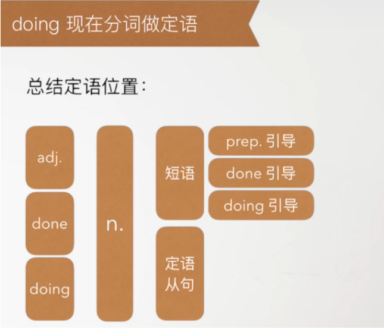

# Doing 做定语

doing 现在分词做定语: 主动进行 / 主动一般


```text
the sinking ship = the ship that is sinking.
the rising sun = the sun that is rising.
the sleeping child = the child who is sleeping.
I like the girl dancing with that guy.
```


定语使用位置
